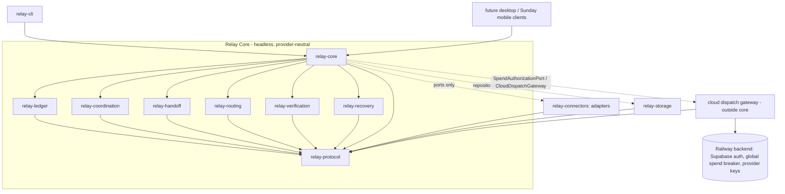
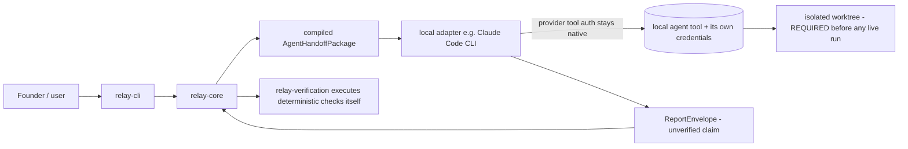
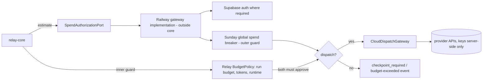
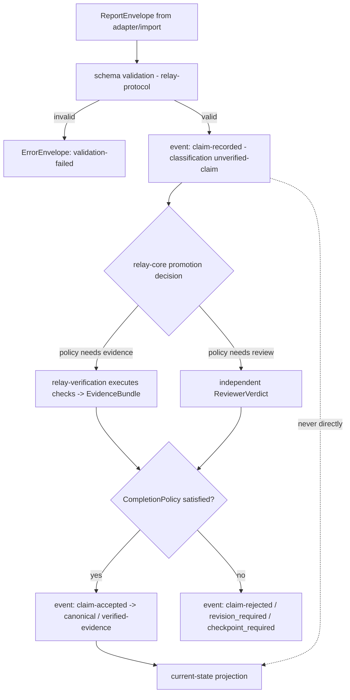
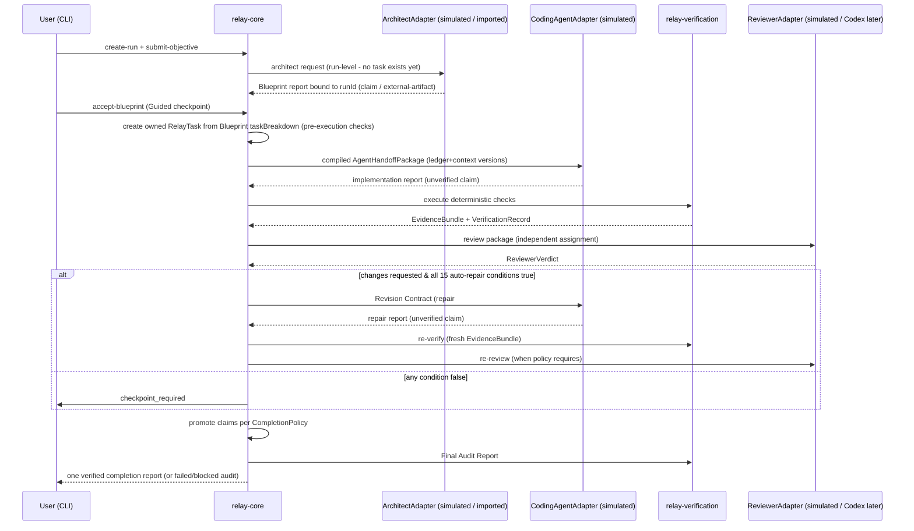
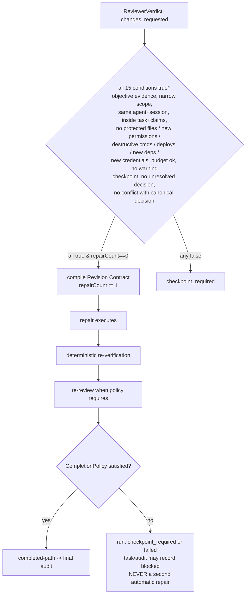

# Sunday Relay — Architecture (authoritative)

> **Implementation sync (Prompt 8, 2026-07-23):** the real Claude Code local
> adapter is implemented in `src/relay/connectors/claude-code/`, behind the
> existing provider-neutral `CodingAgentAdapter` port (Relay Core never
> imports it; boundary-tested). It runs Claude ONLY inside a ready Prompt-7
> isolated workspace (cwd), with a credential-stripped environment, tool
> restrictions (no Bash/network/MCP), `--safe-mode`/`--strict-mcp-config`
> settings+MCP isolation, bounded runtime/output, cancellation, and
> hidden-reasoning omission. The agent report is an unverified claim; Relay
> independently inspects the worktree and runs verification (`node --test`)
> through the Prompt-7 command runner. Only the workspace module and this
> adapter use `child_process`. The live proof is explicit
> (`npm run relay:claude:live`, `--confirm-live`) and never part of tests,
> builds, or CI. Codex reviewer, Hermes, and durable persistence remain
> unavailable; the simulated YC workflow is unchanged. See
> CLAUDE_CODE_ADAPTER.md.

> **Implementation sync (Prompt 7, 2026-07-22):** the isolated worktree and
> safe local execution foundation is implemented in `src/relay/workspace/`
> — the ONLY Node process/filesystem zone in Relay, composed solely by
> `createWorkspaceService` (its composition root). Provider-neutral ports
> (`WorkspaceManagerPort`, `WorkspaceInspectionPort`, `CommandExecutionPort`)
> keep Relay Core free of `child_process`/fs (boundary-tested both ways);
> pure policy modules (contracts, protected-paths, command-policy,
> output-sanitizer, cleanup) stay browser-safe. Real `git worktree`
> isolation under `<parent>/.relay-workspaces/<project>/<run>/`, pinned
> revisions, run-specific `relay/run/<token>` branches, shell-free bounded
> command execution, live-provenance evidence. Simulation scenarios are
> untouched (workspace profiles: none/simulated/local_isolated — existing
> demos stay simulated). See WORKSPACE_SECURITY.md. The Claude Code
> adapter itself remains unimplemented.

> Status: **locked** (Phase 1 architecture lock, 2026-07-21), incorporating
> all ten founder decisions. Companion documents: `PROTOCOL.md` (contracts),
> `RELAY_MVP_SPEC.md` (product scope), `SECURITY_BOUNDARIES.md`,
> `TEST_STRATEGY.md`, `DECISIONS.md` (ADRs), `UI_VISION.md` (visual
> direction). Root-level `RELAY_STATUS.md` / `RELAY_INTEGRATION.md` are
> superseded historical documents.

## 1. Repository placement

Relay lives in this repository as **directories under `src/relay/*` inside
the existing npm package** — no monorepo split, no new packages. Rationale
(validated against the repo): the single tsconfig project includes only
`src/`; the backend already demonstrates the pattern of an esbuild-bundled
node entry (`server/index.ts → dist-server/index.cjs`), which the future
Relay CLI copies (`src/relay/cli/ → dist-relay/cli.cjs`); vitest and the
boundary-test pattern already cover `src/relay/**`. The existing prototype
code is reorganized under the same root in a later prompt (nothing moves
during the architecture lock).

Planned layout (directories = the logical boundaries of Decision 8):

```
src/relay/
  protocol/        envelopes, schemas, enums, versioning, validation
  core/            run state machine, orchestrator, checkpoints, repair loop,
                   policy coordination, claim promotion
  ledger/          typed append-only events, ledger version, projections
  coordination/    task ownership, leases, claims, dup/stale detection
  handoff/         package compiler, context selection, compilation records
  routing/         agent profiles, manual/default assignment
  verification/    deterministic checks, evidence, completion, final audit
  recovery/        failure records, repeated-failure/no-progress detection
  connectors/      adapter interfaces + simulation adapters (live later)
  storage/         repositories + usage ledger (later prompt; in-memory first)
  cli/             terminal client (later prompt)
  prototype/       the golden-path web prototype (moved, preserved, labeled)
```

## 2. Module dependency direction

Strict acyclic direction; `protocol` at the bottom, clients at the top.
`core` depends on ports (interfaces), never on concrete adapters, storage
engines, fusion-engine, server, browser, or credentials (Decision 1).



Clients depend ONLY on serializable protocol commands/queries/events/read
models (Decision 9); node-only imports are confined to `storage`, `cli`,
`connectors`, and gateway implementations, keeping `core` transportable to a
service boundary for future web/mobile clients.

## 3. Hybrid execution architecture (Decision 1)

Two distinct dispatch paths; Relay Core is identical in both.

**Local execution** — the CLI drives locally installed agent tools (Claude
Code, Codex, later Hermes) through local adapters. Provider authentication
stays inside the provider tool; Relay stores only opaque `sessionRef`
strings. No credential is read, printed, serialized into events, or
transmitted. Local live coding-agent execution REQUIRES the isolated
worktree manager (deferred phase) — until it exists and passes its safety
tests, no real local coding-agent adapter may run.



**Cloud / Sunday-managed execution** — anything Aquala funds or dispatches
goes through the Railway backend behind the existing production guards.
Relay's `BudgetPolicy` is the inner workflow guard; the Sunday global spend
breaker is the outer, non-bypassable production guard; BOTH must approve.
Relay Core reaches these through ports only:

- `SpendAuthorizationPort.authorize(estimate) → allow | deny(reason)`
- `CloudDispatchGateway.dispatch(package) → ReportEnvelope`

The concrete Railway implementations live OUTSIDE Relay Core (a gateway
module and/or a `src/fusion-engine/api/` endpoint on the server side) and
may use `verifySupabaseUser`, the global breaker, and server-side keys.
Dependency direction: **gateway implements the port and depends on
relay-protocol; relay-core never imports fusion-engine, server code, or the
gateway implementation.** This supersedes `RELAY_INTEGRATION.md §5` while
preserving its guarantees.



## 4. Canonical Project Ledger & claim promotion

The ledger (PROTOCOL §2.2) is typed, append-only, monotonically versioned,
and the ONLY source of canonical state; the projection is rebuildable from
events. Agent reports and imported artifacts enter as `unverified-claim` /
`external-artifact` and change canonical state only through relay-core
promotion (PROTOCOL §3.1). This is the repo-level cure for the prototype's
self-reported-evidence pattern (Decision 7: prototype paste evidence stays
classified `unverified claim`).



## 5. Sequential MVP workflow (one run, Guided Mode)



## 6. Guided Mode one-repair flow (Decision 4)



## 7. Subsystem responsibilities (summary)

- **relay-protocol** — the shared language: envelopes, schemas, enums,
  validation, versioning. Everything depends on it; it depends on nothing.
- **relay-core** — the ONLY decision maker: run state machine, orchestration,
  checkpoint decisions, the bounded repair loop, policy coordination, claim
  promotion. No IO, no credentials, no provider names.
- **relay-ledger** — sole event appender; ledger version; projections.
- **relay-coordination** — ownership, leases, claims, duplicate-work and
  stale-context detection (the System-5 pre-execution battery).
- **relay-handoff** — compiles role-specific responsibility contracts from
  ledger refs at pinned versions; records compilation inputs.
- **relay-routing** — MVP: manual/default role → adapter assignment;
  future: capability observations, adaptive routing (seam only).
- **relay-verification** — executes deterministic checks itself, owns
  evidence integrity, CompletionPolicy evaluation, independent-review
  requirement, Final Audit Report.
- **relay-recovery** — failure records, repeated-failure/no-progress
  detection; future recovery packages and reassignment (seam only).
  Disagreement records (PROTOCOL §5.2) are ledger data in the MVP; the
  future resolution engine belongs to relay-core (see §8).
- **relay-connectors** — adapter INTERFACES (Architect / CodingAgent /
  Reviewer / Verification) + simulation adapters; future local/cloud
  adapters. Simulation adapters state which policies they simulate vs
  enforce.
- **relay-storage** — repository ports + implementations (in-memory first,
  local persistence next; direction: append-only JSONL event log + JSON
  projections under a project-local `.relay/` directory, no new
  dependencies — see DECISIONS ADR-016).
- **relay-cli** — thin client: sends commands, renders normalized events,
  answers checkpoints, inspects state. Zero workflow logic.

## 8. Future seams (reserved, not built)

- **Parallelism** — RelayTask already carries dependencies, claims, leases,
  `supersededBy`, `baseRevision`; relay-coordination owns the future
  scheduler; nothing in the sequential MVP assumes single-task invariants in
  its persisted contracts.
- **Routing** — AgentProfile + capability observations slot into
  relay-routing behind the same assignment interface.
- **Recovery** — FailureRecord carries the raw material; recovery package
  compilation + reassignment plug into relay-recovery.
- **Disagreement resolution** — DisagreementRecord schema ships in Prompt 2
  (relay-protocol); competing proposals and the named decision authority
  are preserved as ledger events; the future resolution engine slots into
  relay-core with escalation to human checkpoints — never an open-ended
  debate loop.
- **Portable Aquala Skills** — provider-neutral skill source compiled into
  provider formats; reserved as a relay-handoff/relay-routing consumer;
  no critical procedure lives only in provider prompts.
- **Mission Control UI** — clients of the same core over the same protocol
  (UI_VISION.md §6 documents the UI-facing contracts).

## 9. Relay versus Ophiuchus boundary

Ophiuchus is a reserved Sunday product name (AGENTS.md §1) with no
functionality in this repository today. Boundary: Relay owns agent
orchestration, handoffs, verification, and project-ledger intelligence; any
future Ophiuchus product integrates with Relay the same way every other
surface does — as a client or adapter over `relay.protocol.v1` — and gains
no privileged access to Relay Core internals. No Ophiuchus assumptions are
baked into any Relay contract. (Founder refines this boundary when
Ophiuchus is defined.)

## 10. Prototype versus production architecture (Decision 7)

The golden-path web app (`/relay.html`, `src/relay/` prototype modules) is
the **Relay Protocol Prototype**: a committed, working, human-operated
paste-transport experiment. It is a design seed (validators, gate
predicates, test patterns), a demonstration artifact, and NOT the
authoritative architecture. Its differences are structural: browser-resident
(vs headless core), paste transport (vs adapters), self-reported pasted
evidence (vs Relay-executed EvidenceBundles — its evidence is classified
`unverified claim`), prose ledger lines (vs typed events), artifact-presence
stages (vs the RelayRun/RelayTask state machines), success-only verification
record (vs pass/fail VerificationRecords). It is preserved unmodified during
this phase and demoed only under the label "Relay Protocol Prototype".
